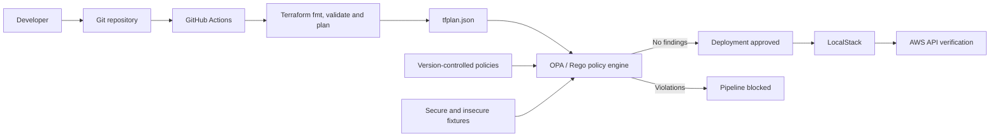

# DevSecOps Policy as Code

[](https://github.com/Owasamly/devsecops-policy-as-code/actions/workflows/terraform-security.yml)

A focused DevSecOps lab that turns infrastructure security requirements into automated deployment gates. Terraform builds a local AWS-style environment in LocalStack, while Open Policy Agent (OPA) evaluates the Terraform plan before any resource is applied.

The project demonstrates the practical control loop behind policy as code:

1. Terraform produces a machine-readable execution plan.
2. OPA evaluates that plan against version-controlled Rego policies.
3. Violations are returned as structured JSON findings.
4. CI blocks non-compliant infrastructure before deployment.
5. Approved infrastructure can be applied to LocalStack and verified through the AWS API.

## Security controls

| Control            | Policy behavior                                                    |
| ------------------ | ------------------------------------------------------------------ |
| S3 encryption      | Requires a linked encryption resource using `AES256` or `aws:kms`. |
| S3 public access   | Requires all four public-access-block settings.                    |
| S3 versioning      | Requires versioning status `Enabled`.                              |
| Resource ownership | Requires `Environment`, `ManagedBy`, and `Owner` tags.             |
| Network exposure   | Rejects IPv4 or IPv6 ingress from the entire internet.             |

Each S3 policy follows Terraform configuration references back to the specific bucket it protects. This prevents an encryption resource attached to one bucket from satisfying the policy for another bucket.

## Architecture



See [docs/ARCHITECTURE.md](docs/ARCHITECTURE.md) for the design and trust boundaries.

## Repository structure

```text
.
├── .github/workflows/       CI validation and policy gate
├── docs/                    Architecture, evidence, and recording guidance
├── policies/                Rego controls evaluated against Terraform JSON
├── scripts/                 Local scan and deployed-control verification
├── terraform/               Secure S3 and network demonstration resources
├── tests/fixtures/          Known-good and known-bad Terraform plan fixtures
├── tests/opa/               OPA unit tests
├── docker-compose.yml       Pinned LocalStack service
└── Makefile                 Reproducible developer commands
```

## Prerequisites

- Terraform 1.15 or newer (below 2.0)
- OPA 1.16 or newer
- Docker with Compose
- `jq`
- AWS CLI v2, only for post-deployment verification

## Quick start

Run the fast checks without starting LocalStack:

```bash
make validate
make policy-test
make scan
```

`make scan` uses `terraform plan -refresh=false`, so the pre-deployment policy gate does not require LocalStack. Generated plans and reports are written to ignored directories:

```text
.generated/tfplan.json
reports/policy-report.json
```

To show the blocking path using a safe, synthetic plan:

```bash
make demo-fail
```

To deploy and verify the compliant infrastructure locally:

```bash
make apply
make verify
```

The verification script supplies LocalStack's conventional `test` credentials
only to its own AWS CLI process. You do not need an AWS account or `aws configure`.

When finished:

```bash
make destroy
make localstack-down
```

## Expected policy output

A compliant plan ends with:

```text
Policy gate passed: no violations found.
```

The negative fixture produces structured findings such as:

```json
{
  "code": "NETWORK_WORLD_INGRESS",
  "resource": "aws_security_group.insecure",
  "message": "Security-group ingress must not allow traffic from the entire internet"
}
```

## CI pipeline

The workflow runs three explicit stages:

- **Terraform Format and Validation** checks formatting, initializes providers without a backend, and validates the configuration.
- **OPA Unit and Negative Tests** checks Rego formatting and syntax, runs unit tests, proves the secure fixture passes, and proves the insecure fixture is blocked.
- **Terraform Plan Policy Gate** generates the real Terraform plan, evaluates all policies, and uploads the plan plus JSON report as build evidence.

OPA and Terraform versions are pinned in the workflow. The downloaded OPA binary is checksum-verified before execution.

## Deliberately testing a rejection

Do not weaken the secure Terraform just to produce a screenshot. The repository includes `tests/fixtures/insecure-plan.json` specifically for this purpose. It demonstrates missing S3 controls, missing ownership metadata, and unrestricted SSH ingress without deploying unsafe infrastructure.

## Portfolio evidence

The strongest evidence set is:

1. The GitHub Actions summary with all three jobs passing.
2. `make demo-fail` showing the policy engine block five known violations.
3. `make scan` showing the real Terraform plan pass with zero violations.
4. `make verify` showing encryption, versioning, public-access controls, tags, and the restricted security group in LocalStack.

Use [docs/RECORDING_GUIDE.md](docs/RECORDING_GUIDE.md) for exact commands and a short recording sequence.

## Scope

This repository is a local mechanics lab, not a production AWS landing zone. LocalStack keeps the exercise reproducible and cost-free; the policy design, Terraform plan format, CI gate, and Rego tests are the transferable parts.
