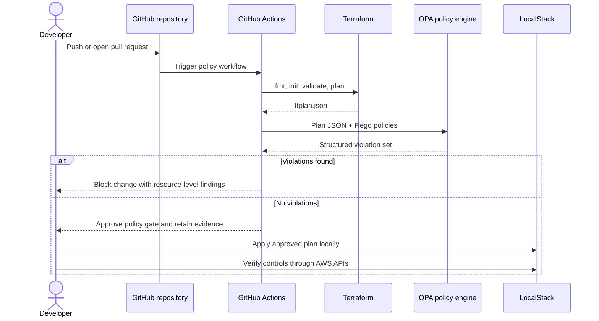

# Architecture

## Goal

The system prevents unsafe infrastructure changes from reaching an apply step. Its enforcement point is the Terraform plan, where proposed resource values are available but no infrastructure has been changed.

## Control flow



## Components

### Terraform

Terraform declares a tagged S3 bucket with encryption, versioning, and complete public-access blocking. It also declares a VPC and a security group whose HTTPS ingress is restricted to a trusted CIDR.

The CI plan uses `-refresh=false`. This allows static evaluation before LocalStack is running and prevents the gate from depending on mutable remote state.

### OPA and Rego

OPA loads every policy in `policies/` into the `terraform.security` package. Findings share a stable schema:

```json
{
  "code": "CONTROL_IDENTIFIER",
  "resource": "terraform.resource.address",
  "message": "Human-readable explanation"
}
```

The S3 policies inspect `configuration.root_module.resources` to resolve Terraform references. A supporting control must reference the exact bucket under evaluation and must also be part of the active plan. Delete-only changes are excluded from enforcement.

### Test fixtures

The secure fixture represents the required baseline and must yield zero findings. The insecure fixture is synthetic and must yield exactly five control failures. These tests protect both sides of the gate: avoiding false positives and proving known-bad changes are rejected.

### LocalStack

LocalStack emulates S3, IAM, and EC2 APIs on `127.0.0.1:4566`. It is outside the CI enforcement path and exists to demonstrate that an approved plan can be applied and queried end to end.

## Trust boundaries

- Repository input is untrusted until the Terraform and OPA checks pass.
- The plan JSON is generated inside CI rather than accepted from the repository.
- The OPA executable is version-pinned and checksum-verified.
- CI receives read-only repository permission.
- Generated plans, reports, local state, and LocalStack data are excluded from version control.

## Extension points

The same structure can be extended with controls for IAM wildcards, mandatory KMS keys, approved regions, cost metadata, or Terraform modules. Each new control should include a passing and failing fixture before it enters the deployment gate.
